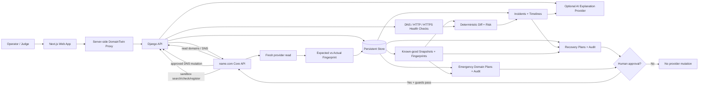

# Gate 10 — Architecture + Security Model

## Architecture goal

DomainTwin separates **observation**, **deterministic decision logic**, **human approval**, and **provider mutation** so that neither the browser nor the AI layer can silently change DNS.



---

# Component responsibilities

## Browser / Next.js

- Displays domain state, incidents, evidence, recovery plans and audit.
- Never receives name.com API credentials.
- Never calls name.com directly.
- Cannot bypass backend mutation guards.

## Server-side proxy

- Keeps browser requests on the DomainTwin origin.
- Provides the web-to-backend boundary.
- Prevents provider credentials from being embedded into client-side code.

## Django API

- Owns provider integrations and all mutation policy.
- Normalizes name.com errors.
- Builds snapshots/diffs/risk/incidents/recovery plans.
- Requires explicit approval before mutation.
- Re-reads provider state after recovery.
- Persists ordered audit evidence.

## name.com Core API

name.com is the registrar/DNS execution plane used to:

- list/read domains;
- read DNS records;
- create/update/delete DNS records;
- search emergency-domain candidates;
- check availability;
- register the controlled sandbox emergency domain;
- read/clone/re-read destination DNS.

## Persistent store

Persists the evidence required to prove continuity:

- immutable DNS snapshots;
- known-good selection;
- fingerprints;
- health observations;
- incidents and timelines;
- AI explanation records;
- recovery plans/results/audit;
- emergency-domain plans/results/audit.

## Optional AI provider

- Receives structured incident evidence.
- Produces an explanation only.
- Has no DNS mutation tool or provider credential.
- May be disabled without disabling diff/risk/recovery.

---

# Security model

## 1. Provider credentials remain server-side

`NAMECOM_USERNAME` and `NAMECOM_API_TOKEN` are loaded by the backend. Browser requests go through the DomainTwin proxy. Provider Authorization material is not part of the frontend contract.

## 2. Mutation is default-off

DNS mutation requires the backend mutation flag. Production mutation requires a second explicit production opt-in.

The default safe state used in final verification is:

```text
NAMECOM_ENVIRONMENT=sandbox
NAMECOM_ALLOW_MUTATIONS=0
NAMECOM_ALLOW_PRODUCTION_MUTATIONS=0
NAMECOM_ALLOW_DOMAIN_REGISTRATION=0
AI_PROVIDER=disabled
```

## 3. Emergency registration has a stronger boundary

Hackathon emergency-domain registration:

- is hard limited to `sandbox`;
- requires the normal mutation flag;
- requires the second domain-registration flag;
- requires an approved persisted plan;
- requires an exact target-domain execution confirmation;
- uses a persisted idempotency key;
- can never execute in production in the Gate 8 implementation.

## 4. Human approval precedes provider mutation

Recovery and emergency-domain plans begin as previews. The operator must explicitly approve the plan before any provider mutation can execute.

AI does not satisfy this boundary.

## 5. Plans defend against stale state

A recovery preview freezes the live fingerprint. Before apply, DomainTwin re-reads live DNS. If DNS changed after preview, the plan becomes `STALE` and mutation is blocked.

This prevents an operator from applying a plan to state they never reviewed.

## 6. Recovery cannot claim success without verification

After provider mutation, DomainTwin performs a fresh provider read and computes the normalized DNS fingerprint.

Success requires:

```text
expectedFingerprint == actualFingerprint
```

If an operation fails or verification mismatches, the plan remains `PARTIAL` or `FAILED`; the UI never fabricates `RECOVERED`/`READY`.

## 7. Audit is part of the trust boundary

Recovery and emergency-domain operations persist ordered events so the operator can inspect:

- plan creation;
- approval;
- mutation start;
- each operation result;
- verification;
- final state.

## 8. AI is advisory and evidence-bound

AI receives deterministic evidence and returns a structured explanation. It cannot execute CREATE/UPDATE/DELETE/REGISTER operations. If the provider is unavailable or AI is disabled, deterministic incident and recovery functionality remains available.

## 9. Browser payload minimizes registrar data

Domain responses exposed to the UI are filtered to operational metadata. Registrar contact/PII fields are not required by the continuity workflow and are intentionally excluded from the browser boundary.

---

# Trust boundaries at a glance

| Boundary | Enforcement |
|---|---|
| Browser → registrar | No direct provider access; server-side proxy/backend only |
| AI → DNS | No mutation capability; advisory output only |
| Preview → mutation | Explicit human approval required |
| Sandbox → production | Environment + second production mutation opt-in |
| Emergency registration | Sandbox-only + second registration flag + exact target confirmation |
| Reviewed state → apply | Live fingerprint re-read; changed state becomes `STALE` |
| Mutation → success | Fresh provider read + exact fingerprint match |
| Provider failure → UI | Explicit error/partial/failed states; never false success |

---

# Production hardening still required after hackathon

Gate 10 documents a credible path, not a claim that the current local hackathon deployment is production-ready.

Before commercial production:

- managed secret storage / KMS;
- encrypted tenant credential storage;
- real authentication and organization isolation;
- RBAC / approval roles;
- CSRF/session hardening appropriate to deployment;
- rate limiting and abuse controls;
- queue/scheduler for monitoring jobs;
- structured logging and production observability;
- backups and restore drills;
- dependency/security scanning;
- incident response/runbooks;
- production infrastructure and disaster recovery;
- privacy/data retention policies.

The important feasibility proof is that these are standard SaaS/operations milestones around an already-working domain-specific recovery engine.
